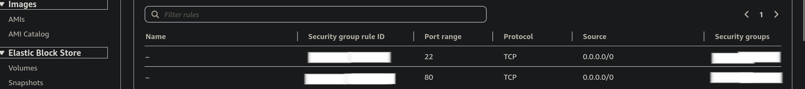
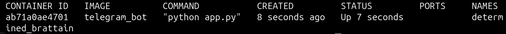

# AWS Application: implementation of a Telegram Bot that performs an image search in a HuggingFace Space.

The architecture that must be implemented can be seen in the Figure below.

We include a HuggingFace Space given that the Free Tier of AWS did not offer enough computational resources to run a model like CLIP (only 1 GB of RAM).

**Importantly, make sure that you have all the necessary permissions for your IAM account on each step to create/get information/edit/delete EC2 Instances, APIs from API Gateway, Lambda functions and everything that indirectly depends on them.**

## Step 1: Create a Telegram Bot

Go to the GodFather bot in Telegram and follow all the steps to create a new bot. Select the name to display, the username and store the TOKEN that is associated with it (without the token, you will not have permissions to implement the bot). Below you can see to which bot I refer.

</img>

Using it is fairly simple. as you just need to type <code>/newbot</code> and follow the instructions.

</img>

After following the steps and saving your TOKEN (that is necessary to implement the bot, not to check if it was created successfully), you can just use your new bot.

</img>

Now, if you type <code>/start</code>, the bot will do nothing. Do not be surprised, because we have not implemented its behaviour yet!

## Step 2: Implement the code that controls the behaviour of the bot (mock)

<code>**Stack:** Docker and Python (pyTelegramBotAPI library)</code>

For this case, we will start working in local with a Docker image that implements the behaviour of the bot (still a mock behaviour, but it is a good basement for later).

</img>

We can use a recent Python image like <code>python:3.12-slim</code> as it should be enough.

We must create a <code>requirements.txt</code> file including a line like <code>pyTelegramBotAPI==4.26.0</code> for the telebot dependency.

Then, we create the python file for the app, for example, <code>app.py</code>. Using <a href="https://github.com/eternnoir/pyTelegramBotAPI?tab=readme-ov-file#a-simple-echo-bot">this as an example</a> should be enough to create an echo bot or something similar.

After that, create the Docker image and run it. For that, I have coded a <code>Dockerfile</code> that is included in the directory <code>telegram_bot</code> of this repository.

If everything has been done correctly, the bot should answer when sending the command <code>/start</code>. In my case, I changed the code a bit, so the bot only answers to <code>/query</code> because this is going to be the command that I will use to perform the searches (later, we will see what we do with the <code>/start</code> command).

</img>

## Step 3: Create an API with API Gateway and connect it to the Lambda function

In this step, we can create an API with the AWS API Gateway service and then connect it to the Lambda function that is going to make queries to the HuggingFace Space. I should say that this part of the architecture is actually unnecessary, because we could directly call the HuggingFace API from the EC2 instance that we are building later, but I wanted to add this part because in this way I can also include Lambda and API Gateway to the project and show people how it is integrated.

<figure>
    </img>
    <figcaption>There is an option to create an HTTP API and a REST API. I do not really know the differences that exist between both in practice, so I decided to choose HTTP API. </figcaption>
</figure>

We create an HTTP API with an endpoint that can be, for example, <code>/search</code>. In this case, the most appropriate thing to do is to use a GET method.

</img>

Then, we create a Lambda function that will contain the code that connects with the HuggingFace Space. For this, we need to go from the API Gateway to the AWS Lambda service. If you do not have any function previously created, this is what you are going to see.

</img>

So let's create a new function from scratch. In this case, I decided to use a Python 3.12 environment.

</img>

After creation, the dashboard will look like this. This is quite interesting, given that we can easily see three great components of the Lambda function: triggers, layers and destinations. For this application, we are going to link one trigger (the API we previously created) and a layer (to include the dependencies that we require).

</img>

First, we can link the Lambda function we created with the <code>GET /search</code> method of the API.

</img>

After linking the API with the Lambda function, the dashboard will look like this.

</img>

The next step is to add a layer to make sure that the code can be executed. Of course, the client that we will use to connect to HuggingFace is a non-native Python package, so we need to install it before anything else. This is done in the next step.

## Step 4: Code the Lambda function connecting it with the corresponding HuggingFace Space

First of all, before uploading it to the Lambda function, we are going to run it locally. To that end, we use a Python Virtual Environment, given that is necessary to install the <code>gradio_client</code> library. This dependency will be later resolved creating a layer for the Lambda function. The VENV will provide us a way to easily compress all the dependencies and upload the compressed file to the layer of the Lambda function.

Thus, we create the Python Virtual Environment, we activate it and finally, we install the required package (in this case, <code>gradio_client</code> with <code>pip3 install gradio_client</code>).

This package is installed within the files of the Python environment. What we need to upload to the Lambda layer is the path <code>$VIRTUALENVPATH/lib/python3.12/site-packages</code>. This is because the path required for a Python installation must be the one shown in the Figure below:

</img>

For each programming language is different, so if you want to add a layer you need to check how the path must be built before uploading the ZIP.

</img>

Now, we can go to check the code that is created by default for the Lambda function.

</img>

If everything has been set up correctly, we could check the behaviour of the API method by calling the full URL from a command line or even a browser, in which case we would receive a message saying "Hello from Lambda!".

After a process of coding, debugging and refining, we come out with the definitive code! This is included in the <code>clip_image_search_client</code> directory of this repository. Apart from setting the method <code>GET /search</code> we have also added a query parameter as can be seen in the picture below. This parameter indicates the text prompt of what we are searching for. The program returns the URLs of the images that have been found.

</img>

## Step 5: Connect the Docker container created in Step 2 with the API Gateway

In this step, the mock code made in Step 2 will be modified to connect to the API Gateway. In this manner, we will have the actual implementation of what we want the bot to do. In particular, we will connect the bot with the code that was developed in the previous Step 4. The code of this part can be found in the directory <code>telegram_bot</code> of the current repository.

Firstly, I decided to run the code locally using Docker. Then, the idea is, one the code is refined, everything necessary will be uploaded to the EC2 Instance. Once there, the Docker Container will be run in the background, allowing the bot to work and interact with the API that we have created.

From the client side, the result looks like it is shown in the following figures. First of all, we have the behaviour of the <code>/start</code> command that we mentioned at the start of this document. Both <code>/start</code> and <code>/help</code> will show the same output: the simple instructions to use the bot.

</img>

When typing something like <code>/query bus</code>, we get something like this:

</img>

I found this useful, as it makes the bot to answer the user immediately, avoiding them to thinking "well, it seems that this bot does not work very well or I did not type the command correctly". After a few seconds, if everything is ok, we should receive something like this:

</img>

Well, probably not the most complex application and useful application ever, but it is a great demonstration of how to integrate all these technologies together. I honestly loved seeing this working! 🥰

## Step 6: Run an EC2 Instance with the Docker container refined in Step 5

Obviusly, now we have the problem that the Telegram bot relies in our local server, very probably the beloved PC we used to develop, and of course we do not want that. Thus, to avoid this situation, we go to the last step of our journey: the creation of an EC2 instance.

For that, we need to go to the AWS EC2 service in the platform and create a new Virtual Machine, selecting an AMI that is available (Amazon Machine Image). I will not go into the very details of this process because it is as simple (well, moreless) as creating a normal Virtual Machine: you need to choose the Operating System, hardware requirements and that's that!

</img>

In my case, I decided to choose an Ubuntu Server image because this is the Operating System I am more comfortable with in this moment, but feel free to use what you want/what fits to your case. For hardware, I want to stick to the requirements eligible for the Free Tier. They are more than enough for this application, featuring 1 GB of RAM and 1 vCPU, which is perfect for a small test like this (of course, if you want to scale an application like this, the selected hardware requirements could lead to a quick resources' shortage).

Apart from the hardware and OS requirements, also make sure that the firewall opens the ports you want to use. In this case, we need to open the port number 80 to allow HTTP traffic.

</img>

Once created, you can use login via <code>ssh</code> (I recommend you to do so) and copy all the stuff from your telegram bot (of course, this implies copying all the code to create your docker image). After following the same process as in your local server, you come out with a built docker image. Once created, it is just as simple as running it in the background, and everything should work in the same way as after the end of the previous step. Below find the image of the docker container running successfully in the background of the VM.

</img>